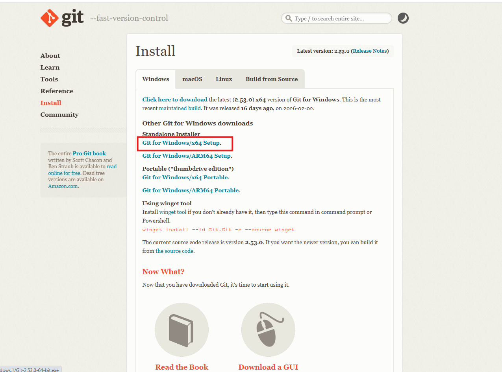
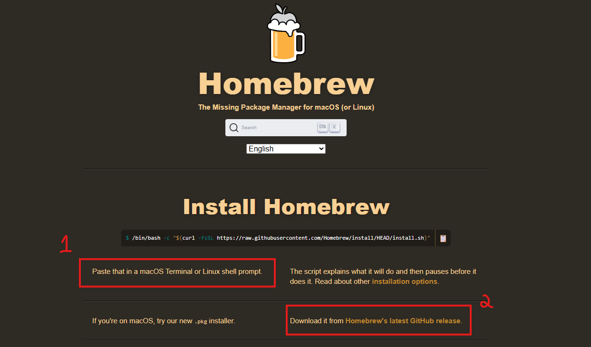
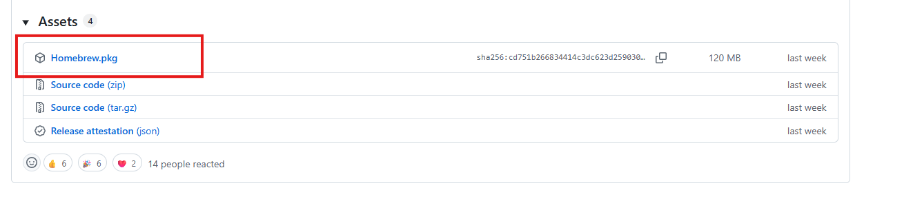
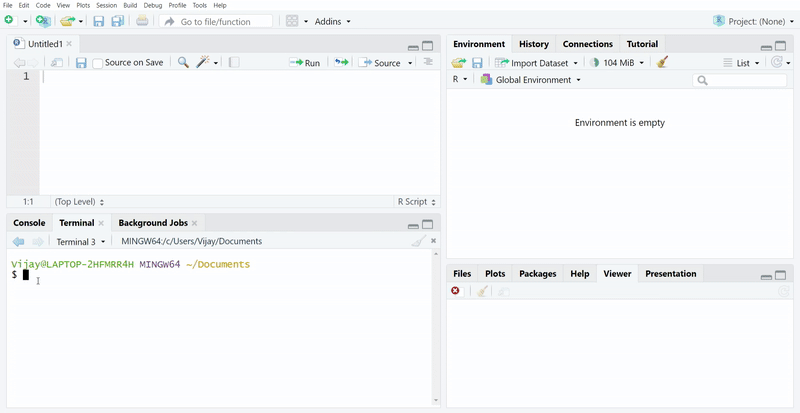
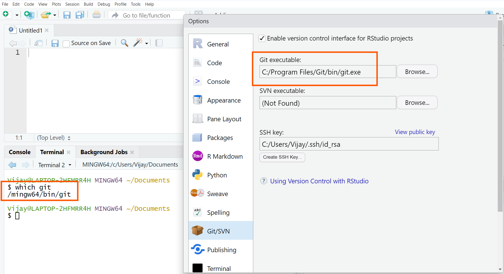

## Reproducible Scientific Practices for Conservation Biologists

### Pre-workshop instructions

1.  Please bring your own device, preferably with [RStudio](https://posit.co/products/open-source/rstudio/?sid=1) installed. It is recommended that users update their R/RStudio to the most recent version to avoid any errors. Please click these links to update R on [Windows](https://youtu.be/MzZXFG7ZcVM?t=5) and [Mac](https://youtu.be/MzZXFG7ZcVM?t=539).  
2.  Create a account on [GitHub](https://github.com/) - it's free!. Please note that when you are creating a GitHub account for the first time, please **do not** click the 'Continue with Google' option and instead manually enter your email address, set a password and username. Else, if you used one of your gmail addresses automatically, please ensure that you set a password for your account.
3.  Download and install [Git](https://git-scm.com/downloads). Before you start this step, please close R and RStudio. For Step 3 alone, the process can vary for Windows and Mac systems. Please see below.

**Windows Users**

When you click the download link for Git above, it will take you to the page below. Please click the link marked within the red box to download the program and follow associated instructions.   

**MacOS Users**

It's a two-step process. First, you need to install [Homebrew](https://brew.sh/) using your terminal (Type cmd + spacebar to access terminal on a mac) or by downloading the .pkg file (both options are available through the link above). Option 1 will require you to use your Terminal on Mac and Option 2 requires a manual download and installation. The second screenshot provides an image of the page you will encounter if you try Option 2. Once you are done with either Option 1 or Option 2, and Homebrew is installed, you need to type `brew install git` and paste it in your terminal for the installation of Git to be completed.  

Option 1:

For Option 2, when you click `Homebrew's latest GitHub release`, it will take you to a page on GitHub. You should scroll down to the bottom of the page and click the red box highlighted to download Homebrew manually:

Now please remember that after you install Homebrew, you need to type `brew install git` in your terminal for the installation of Git to be completed. 

### Check if you installed Git correctly

1.  Please go to RStudio and open the **Terminal** pane located right next to the *Console* in the left-bottom panel and type in the following: `which git`. Please note that some Windows machines might recognize the command `where git` instead of `which git`. If you are not able to see the **Terminal** pane, please click on `Tools > Terminal > New Terminal`.

2.  Do you get an error that says: `git: command not found`. If yes, close RStudio and redownload and install [Git](https://git-scm.com/downloads). Once you are done installing it successfully, open RStudio and try the above command in the Terminal pane again: `which git` or `where git` (depending on your Windows machine, `where` might work rather than `which`). **MacOS Users** might encounter a different error. Please see Step 4 below.

3.  If you don't see any error yet, please double-check to ensure that the paths shown on Terminal for where git is located is the same as where RStudio is finding it. To do this, please click on `Tools > Global Options > Git/SVN`. Please note that you only need to ensure that both paths have `/bin/git` or `/git`. You don't have to worry about other content in the paths. Sometimes the `/bin` may not appear depending on the computer but should atleast see a `/git` to learn that your installation has been successful.    

4.  **MacOS users:** might encounter other errors when you type `which git` or `where git`. If you get an immediate offer to install command line developer tools, please go ahead and do it. You should accept the license agreement and click Install. Once installation is completed, please close RStudio and restart RStudio and go to Terminal and type `xcode-select -p`. When you hit enter, you should see `/Library/Developer/CommandLineTools`. Now type `which git` and redo the above Step 3.

5.  If you don't get an automatic message to install Command Line Tools, close RStudio. Then go to <https://developer.apple.com/download/> and download Command Line tools for your OS version. Once installation is completed, please restart RStudio and go to Terminal and type `xcode-select -p`. When you hit enter, you should see `/Library/Developer/CommandLineTools`. Now type `which git` and redo the above Step 3.

If you encounter any other installation errors, please contact me.

### Workshop details

The first part of the workshop will focus on the necessity for reproducible approaches in conservation biology, followed by an introduction to data management, organization, and file naming conventions.

The second half of the workshop will be focused on version control, GitHub and using it with RStudio.

Towards the end, we will go over useful resources and functionality from packages that are commonly used.

### Workshop materials

Within the folder `workshop-materials`, I have uploaded a Powerpoint presentation covering all the workshop content.   